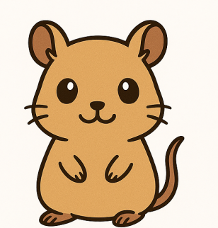
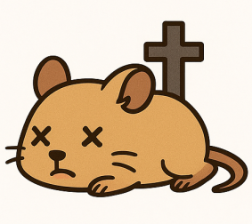

# 🐹 Salva a Roberto 🐹

¡Bienvenido a "Salva a Roberto", el juego más adorable para aprender las tablas de multiplicar! 

## 📱 ¿De qué se trata?

Roberto es un jerbo muy especial que necesita tu ayuda para mantenerse saludable. ¿Cómo puedes ayudarlo? ¡Resolviendo multiplicaciones! 

## 🎮 ¿Cómo jugar?

1. Roberto te mostrará una multiplicación
2. Tienes 15 segundos para responder
3. Si respondes correctamente:
   - Roberto se mantendrá feliz y saludable
   - ¡3 respuestas correctas seguidas mejorarán su salud!
4. Si respondes incorrectamente:
   - Roberto se pondrá triste
   - 2 respuestas incorrectas seguidas empeorarán su salud

## 🎯 Objetivo

Tu misión es mantener a Roberto con vida resolviendo 20 multiplicaciones. ¡Pero cuidado! Si su salud llega a cero, Roberto... 😢

## 🎵 Características

- Efectos de sonido para respuestas correctas e incorrectas
- Retroalimentación táctil (vibración) en respuestas incorrectas
- Interfaz intuitiva y amigable
- Diseño adaptable a diferentes tamaños de pantalla
- ¡Roberto te muestra su estado de salud en tiempo real!

## 🎨 Tecnologías utilizadas

- Kotlin
- Android SDK
- ConstraintLayout
- MediaPlayer para efectos de sonido
- Vibrator para retroalimentación táctil

## 🚀 ¿Cómo ejecutar?

1. Clona este repositorio
2. Abre el proyecto en Android Studio
3. Conecta tu dispositivo Android o usa un emulador
4. ¡Presiona el botón de play y comienza a salvar a Roberto!

## 📝 Notas importantes

- El juego está diseñado para ser educativo y divertido
- Perfecto para niños que están aprendiendo las tablas de multiplicar
- La dificultad se ajusta automáticamente según el rendimiento del jugador

## 🤝 Contribuciones

¿Tienes ideas para mejorar el juego? ¡Las contribuciones son bienvenidas! Algunas ideas:
- Nuevos efectos de sonido
- Más estados de Roberto
- Diferentes niveles de dificultad
- Nuevas animaciones

## 📄 Licencia

Este proyecto está bajo la Licencia MIT. ¡Siente libre de usarlo y modificarlo!

---

¡Gracias por jugar y ayudar a mantener a Roberto saludable! 🐹💕